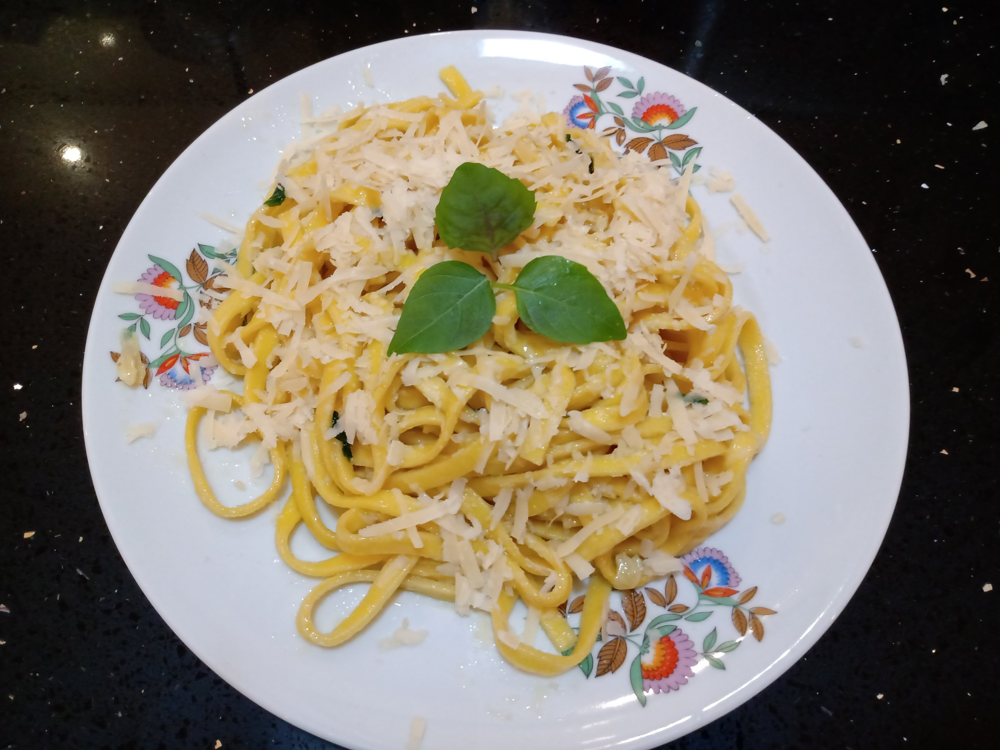

# Talharim na manteiga com alho

Serve uma pessoa com fome ou duas pessoas normais

## Ingredientes

- 1 pacote de talharim Dé, nº 1 ou 2.
- 1 colher de sopa cheia de manteiga
- 1/2 colher de chá de sal
- 6 cabeças de alho branco descascadas. Se for do roxo, use um pouco menos.
- folhas de manjericão a gosto. Se tiver do roxo, melhor ainda.
- parmesão ralado a gosto

## Preparo

- Ferva a água e coloque sal a gosto, para realçar o sabor da massa
- Coloque quatro novelos do talharim na água fervendo, um de cada vez, devagar, tomando cuidado para a água não deixar de ferver
- Enquanto o talharim cozinha, coloque o alho num pilão, cubra com o sal e soque até que você se sinta mais leve. Não recomendo usar um processador de alimentos já que não queremos uma pasta de alho
- entre cinco e dez minutos, prove um fio do talharim e tire do fogo antes que ele fique molenga. Escorra a água e passe rapidamente sob a água fria, para interromper o cozimento.
- coloque a manteira numa frigideira em fogo baixo e deixe derreter
- coloque o alho na frigideira, suba um pouco o fogo e deixe fritar levemente. Se esquentar demais, a manteiga e o alho amargam e ninguém come depois
- rasgue umas folhas de manjericão e coloque na frigideira. Mexa bem a manteiga pegar o gosto
- despeje o macarrão na frigideira e misture bem, para que o alho fique bem espalhado na massa. Se tudo der certo, a frigideira vai ficar praticamente sem resíduos.
- se quiser, coloque mais algumas folhas rasgadas de manjericão
- coloque queijo a gosto e decore com folhas inteiras de manjericão

Experimente também com sálvia no lugar do manjericão.

Vai bem com vinho ou Coca Cola trincando de gelada.

Buon appetito!
